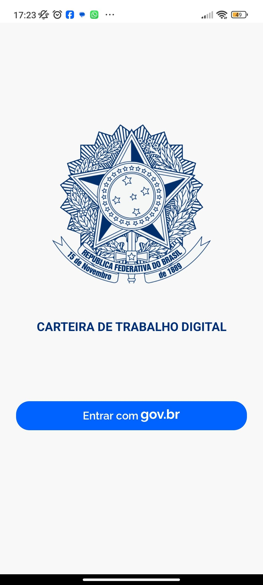
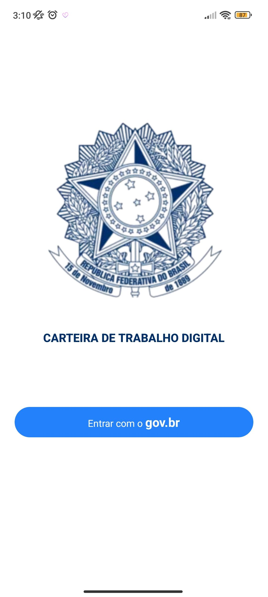
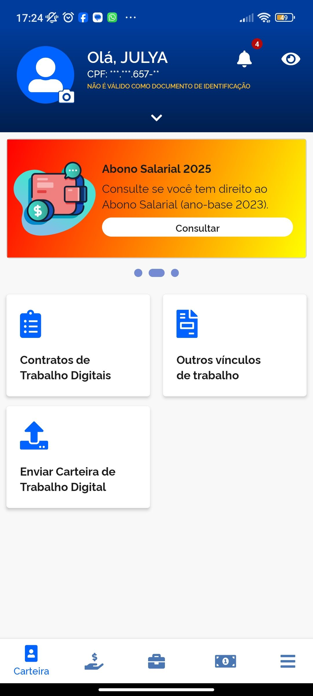
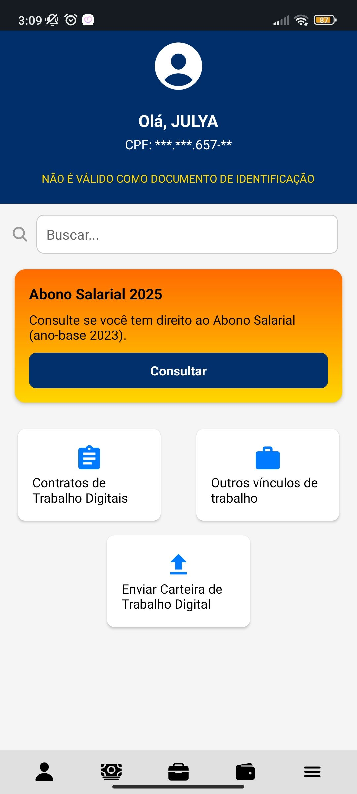

# 📱 Clone da Carteira de Trabalho Digital (Visual)

Este é um **clone visual** do aplicativo **Carteira de Trabalho Digital**, criado com **React Native**. O foco deste projeto foi a reprodução da **interface das telas de Login e Home**, servindo como prática de **estilização** e organização de um app mobile.

⚠️ **Este projeto não possui funcionalidades implementadas** — trata-se apenas do **estilo das telas**, sem integração com back-end, autenticação ou navegação funcional.

---

## 🧪 Tecnologias utilizadas

  
  

---

## 📸 Comparativo de Telas

### 🔐 Tela de Login

<table>
  <tr>
    <td align="center"><strong>Original</strong></td>
    <td align="center"><strong>Clone Desenvolvido</strong></td>
  </tr>
  <tr>
    <td></td>
    <td></td>
  </tr>
</table>

### 🏠 Tela Home

<table>
  <tr>
    <td align="center"><strong>Original</strong></td>
    <td align="center"><strong>Clone Desenvolvido</strong></td>
  </tr>
  <tr>
    <td></td>
    <td></td>
  </tr>
</table>

---

## 👩‍💻 Autora

Desenvolvido com 💙 por [**Julya Werneck**](https://www.linkedin.com/in/julya-werneck-b166892bb/)

